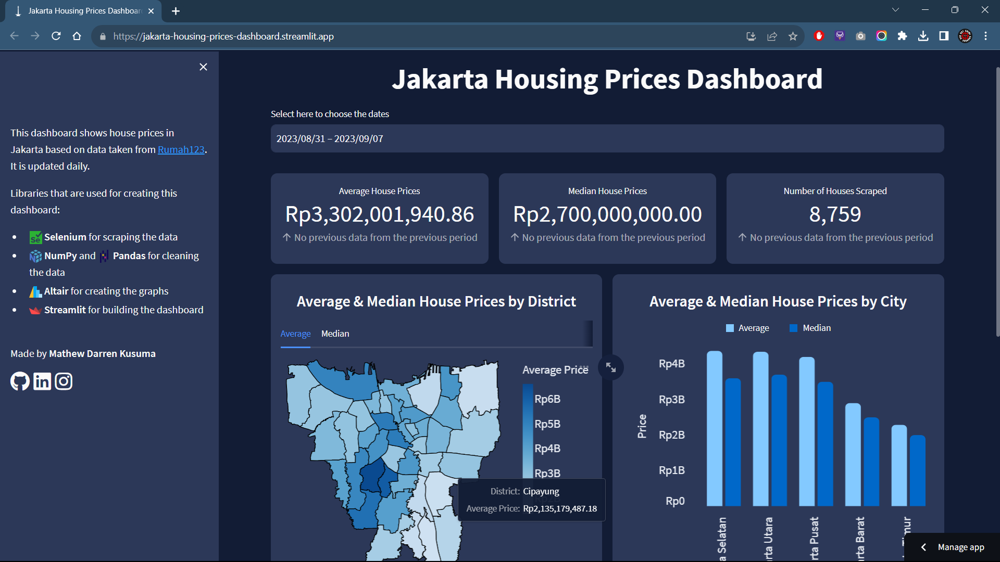

# 🏠 Jakarta Housing Prices 

    
    
    
    
    
    

    
     
    <em>Screenshot of the Dashboard</em>

<h2>👋 Introduction</h2>

The Jakarta Housing Prices Project aims to provide detailed insights into the housing market in Jakarta, the capital city of Indonesia. By collecting and analyzing data from [Rumah123](https://www.rumah123.com/), a popular real estate website, we can gain a comprehensive understanding of price trends, property features, and other relevant factors. This analysis is intended to benefit potential home buyers, real estate professionals, and researchers interested in the Jakarta housing market.

(<a href="#readme-top">back to top</a>)

<h2>🚶 Walkthrough</h2>

This section provides a step-by-step explanation of the process used to create this project:

<h3>🌐 Data Source</h3>

We source our data from [Rumah123](https://www.rumah123.com/), a prominent online platform in Indonesia known for its extensive property listings. This website provides detailed information about various properties, including their prices, locations, sizes, and additional features.

<h3>🔄 Data Scraping & Data Cleaning</h3>

We employ Python along with the Selenium library for web scraping. Selenium allows us to automate the process of extracting housing price data. With carefully crafted scripts, we retrieve the desired information, ensuring accuracy and consistency. Following the scraping process, we apply data cleaning techniques to refine and format the collected data, making it suitable for analysis.

<h3>💾 Data Storing</h3>

We utilize Google BigQuery, a fully managed and scalable cloud-based data warehouse, for storing the cleaned housing price data. BigQuery offers efficient storage and retrieval capabilities, enabling us to handle large datasets with ease. By leveraging the power of BigQuery, we can perform seamless data analysis and generate valuable insights.

<h3>📊 Data Visualization</h3>

To facilitate the exploration and presentation of our findings, we create an interactive dashboard using Streamlit. It provides a user-friendly interface and a wide range of visualization options, allowing us to visualize housing price trends, average and median prices per district and city, and other relevant metrics. The dashboard offers an intuitive way to interact with the data, empowering users to gain valuable insights at a glance.

<h3>📃 Data Overview</h3

In addition to the interactive dashboard, we provide the housing price data in a spreadsheet format. This allows users to access and analyze the data in a more detailed and customized manner. The spreadsheet format offers flexibility for further calculations, filtering, and exploratory analysis, catering to users who prefer working with raw data or conducting their own analyses.

<h3>🤖 Automated Process</h3>

The entire data analysis pipeline is automated using GitHub Actions. Every day at 8 AM, 2 PM, 8 PM, and 2 AM UTC+7, GitHub Actions automatically triggers the data scraping, cleaning, storing, and visualization processes. This ensures that the data and insights are up-to-date and readily available for users without manual intervention.

(<a href="#readme-top">back to top</a>)

<h2>📚 Conclusion</h2>

The Jakarta Housing Prices Project offers comprehensive insights into the housing market in Jakarta, supporting informed decision-making for various stakeholders. The interactive dashboard, created with Streamlit, provides a visually engaging and user-friendly interface for exploring housing price trends and patterns. Additionally, the availability of the data in a spreadsheet format ensures flexibility and customization for deeper analysis.

For a detailed analysis and access to the interactive dashboard and spreadsheet, please visit the following links:

- [Link to Dashboard](https://jakarta-housing-prices-dashboard.streamlit.app/)
- [Link to Spreadsheet](https://docs.google.com/spreadsheets/d/1jZj5tTV1WanOg2qszqDNPI8cAfk3yRRev_ph4J_10IA/edit?usp=sharing)

Feel free to explore the data, analyze trends, and make use of the valuable insights provided by this project.

Data last updated: 2023-09-16 22:58:52.558438

(<a href="#readme-top">back to top</a>)
